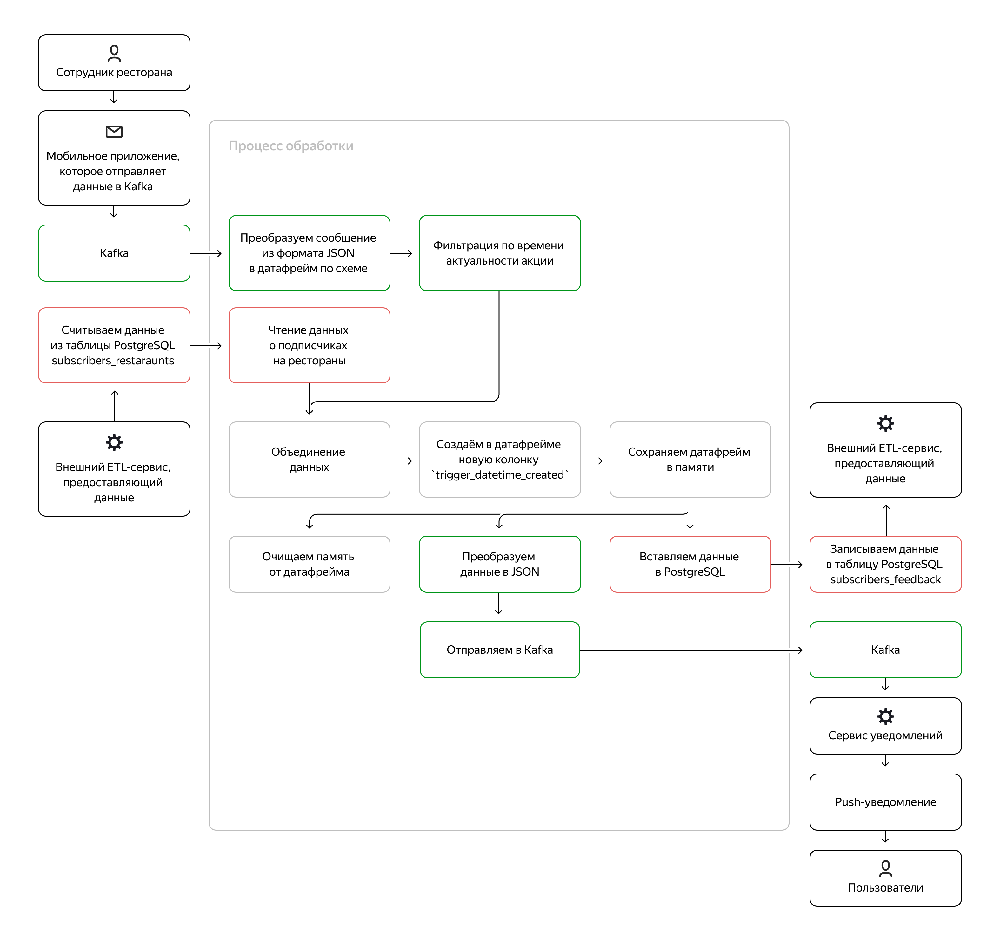

# Проект 8-го спринта

### Описание
Репозиторий предназначен для сдачи проекта 8-го спринта.

### Структура репозитория
Вложенные файлы в репозиторий будут использоваться для проверки и предоставления обратной связи по проекту. Поэтому постарайтесь публиковать ваше решение согласно установленной структуре — так будет проще соотнести задания с решениями.

Внутри `src` расположены две папки:
- `/src/scripts` скрипты реализации решения задачи..

## Задача
### Описание задачи
Ваш агрегатор для доставки еды набирает популярность и вводит новую опцию — подписку. Она открывает для пользователей ряд возможностей, одна из них которых — добавлять рестораны в избранное. Только тогда пользователю будут поступать уведомления о специальных акциях с ограниченным сроком действия. Систему, которая поможет реализовать это обновление, вам и нужно будет создать.

Акции длятся недолго, всего несколько часов, и часто бывают ситуативными, а значит, важно быстро доставить их кругу пользователей, у которых ресторан добавлен в избранное. 

Система работает так:
1. Ресторан отправляет через мобильное приложение акцию с ограниченным предложением. Например, такое: «Вот и новое блюдо — его нет в обычном меню. Дарим на него скидку 70% до 14:00! Нам важен каждый комментарий о новинке».
2. Сервис проверяет, у кого из пользователей ресторан находится в избранном списке.
3. Сервис формирует заготовки для push-уведомлений этим пользователям о временных акциях. Уведомления будут отправляться только пока действует акция.

Cхематично его работа будет выглядеть так:


Сервис будет:
1. читать данные из Kafka с помощью Spark Structured Streaming и Python в режиме реального времени.
2. получать список подписчиков из базы данных Postgres.
3. джойнить данные из Kafka с данными из БД.
4. сохранять в памяти полученные данные, чтобы не собирать их заново после отправки в Postgres или Kafka.
5. отправлять выходное сообщение в Kafka с информацией об акции, пользователе со списком избранного и ресторане, а ещё вставлять записи в Postgres, чтобы впоследствии получить фидбэк от пользователя. Сервис push-уведомлений будет читать сообщения из Kafka и формировать готовые уведомления. Получать и анализировать фидбэк в вашу задачу не входит — этим займутся аналитики.

### Схемы:

Пример входного сообщения:
```
first_message:{
	"restaurant_id": "123e4567-e89b-12d3-a456-426614174000",
	"adv_campaign_id": "123e4567-e89b-12d3-a456-426614174003",
	"adv_campaign_content": "first campaign",
	"adv_campaign_owner": "Ivanov Ivan Ivanovich",
	"adv_campaign_owner_contact": "iiivanov@restaurant.ru",
	"adv_campaign_datetime_start": 1659203516,
	"adv_campaign_datetime_end": 2659207116,
	"datetime_created": 1659131516
}
```

Схема таблицы с подписками (public.subscribers_restaurants):
```
|-- id: integer (nullable = true)
|-- client_id: string (nullable = true)
|-- restaurant_id: string (nullable = true)
```

Выходное сообщение в топик Kafka:
```
{
"restaurant_id":"123e4567-e89b-12d3-a456-426614174000",
"adv_campaign_id":"123e4567-e89b-12d3-a456-426614174003",
"adv_campaign_content":"first campaign",
"adv_campaign_owner":"Ivanov Ivan Ivanovich",
"adv_campaign_owner_contact":"iiivanov@restaurant.ru",
"adv_campaign_datetime_start":1659203516,
"adv_campaign_datetime_end":2659207116,
"client_id":"023e4567-e89b-12d3-a456-426614174000",
"datetime_created":1659131516,
"trigger_datetime_created":1659304828
}
```

Схема таблицы(public.subscribers_feedback), для аналитки:
```
 id serial4 NOT NULL,
 restaurant_id text NOT NULL,
 adv_campaign_id text NOT NULL,
 adv_campaign_content text NOT NULL,
 adv_campaign_owner text NOT NULL,
 adv_campaign_owner_contact text NOT NULL,
 adv_campaign_datetime_start int8 NOT NULL,
 adv_campaign_datetime_end int8 NOT NULL,
 datetime_created int8 NOT NULL,
 client_id text NOT NULL,
 trigger_datetime_created int4 NOT NULL,
 feedback varchar NULL,
 CONSTRAINT id_pk PRIMARY KEY (id)

```

### Команды
```
# write topic
kafkacat -b rc1b-2erh7b35n4j4v869.mdb.yandexcloud.net:9091 \
-X security.protocol=SASL_SSL \
-X sasl.mechanisms=SCRAM-SHA-512 \
-X sasl.username="de-student" \
-X sasl.password="ltcneltyn" \
-X ssl.ca.location=/usr/local/share/ca-certificates/Yandex/YandexCA.crt \
-t student.topic.cohort8.abdurahimd.in \
-K: \
-P
first_message:{"restaurant_id": "123e4567-e89b-12d3-a456-426614174000","adv_campaign_id": "123e4567-e89b-12d3-a456-426614174003","adv_campaign_content": "first campaign","adv_campaign_owner": "Ivanov Ivan Ivanovich","adv_campaign_owner_contact": "iiivanov@restaurant.ru","adv_campaign_datetime_start": 1678615562,"adv_campaign_datetime_end": 2659207116,"datetime_created": 1678879362}

# read topic
kafkacat -b rc1b-2erh7b35n4j4v869.mdb.yandexcloud.net:9091 \
-X security.protocol=SASL_SSL \
-X sasl.mechanisms=SCRAM-SHA-512 \
-X sasl.username="de-student" \
-X sasl.password="ltcneltyn" \
-X ssl.ca.location=/usr/local/share/ca-certificates/Yandex/YandexCA.crt \
-t student.topic.cohort8.abdurahimd.out3 \
-C \
-o beginning
```